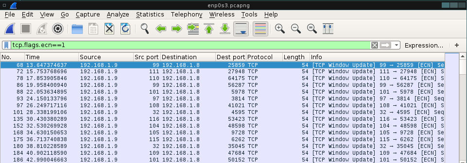

Network Covert Channels
=======================
Proof-of-concept of several covert channels on network and transport layer

### NCCOnPort

* Hide data in network packets exploiting TCP flags and source port as the cover medium and payload


### NCCOnPortKnock

* Hide data in TCP header with a port-knocking scheme to facilitate the process of connection establishment and before tranferring the payload


Requirements
------------

```
$ sudo apt-get install python-scapy python-netifaces
```


Demo
----

Broadcast hidden message to a list of network hosts:

``` 
192.168.1.9 $ sudo python NCCOnPortSender.py --iface enp0s3 --dst 192.168.1.8 --msg "conceal this message in the sourceport of a tcp packet with ece flag set"
Broadcast data: conceal this message in the sourceport of a tcp packet with ece flag set
###[ IP ]### 
  version   = 4L
  ihl       = 5L
  tos       = 0x0
  len       = 40
  id        = 1
  flags     = 
  frag      = 0L
  ttl       = 64
  proto     = tcp
  chksum    = 0xf76d
  src       = 192.168.1.9
  dst       = 192.168.1.8
  \options   \
###[ TCP ]### 
     sport     = 99
     dport     = 45392
     seq       = 0
     ack       = 0
     dataofs   = 5L
     reserved  = 0L
     flags     = E
     window    = 8192
     chksum    = 0x5a8f
     urgptr    = 0
     options   = {}
...
```

Wireshark/tcpdump captures:




Receiver decode the hidden message:

```
192.168.1.8 $ sudo python NCCOnPortReceiver.py --iface enp0s3
enp0s3: Ether / IP / TCP 192.168.1.9:99 > 192.168.1.8:46920 E: c
enp0s3: Ether / IP / TCP 192.168.1.9:sunrpc > 192.168.1.8:59493 E: o
enp0s3: Ether / IP / TCP 192.168.1.9:pop3 > 192.168.1.8:24482 E: n
enp0s3: Ether / IP / TCP 192.168.1.9:99 > 192.168.1.8:42892 E: c
enp0s3: Ether / IP / TCP 192.168.1.9:hostnames > 192.168.1.8:34770 E: e
enp0s3: Ether / IP / TCP 192.168.1.9:97 > 192.168.1.8:23806 E: a
enp0s3: Ether / IP / TCP 192.168.1.9:108 > 192.168.1.8:10532 E: l
...
```
